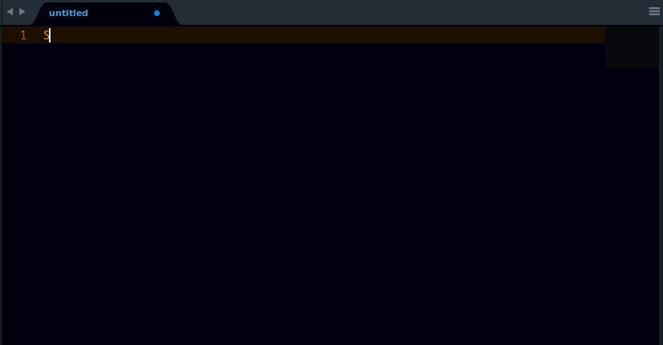

# LangDocs

A sublime text 3 plugin that displays documentation for various language package, class, method as well as lists of methods for certain languages.

Dictionary definition, scrabble and find with friend points, antonym and synonym are also supported for plain text files.

## Supported Languages and scope

* CSS
* HTML
* Java
* JavaScript
* Matlab
* Plain text (Dictionary)
* Python
* Ruby

## Usage

<table border="2px">
<!-- CSS -->
	<tr>
		<th>Language (Scope)</th>
		<th>Key Bindings and Functons</th>
	</tr>
<!-- CSS -->
	<tr>
		<td rowspan="2"><strong>CSS</strong></td>
		<td>
			<strong>Property Description</strong> - Displays a short description for the currently selected CSS property. For example, selecting <strong>color</strong> will display a short description of the color property and a link to its documentation for extra information.
			  <strong>Linux/Windows</strong> - <kbd>Ctrl</kbd>+<kbd>0</kbd>
			 <strong>OSX</strong> - <kbd>Super</kbd>+<kbd>0</kbd>
		</td>
	</tr>

	<tr>
		<td>
			<strong>List Property Values</strong> - Displays a list of available values for the currently selected CSS property. For example, selecting <strong>font-style</strong> will display <code>italic</code>, <code>normal</code>, <code>oblique</code> and a link to its documentation for extra information.
			  <strong>Linux/Windows</strong> - <kbd>Ctrl</kbd>+<kbd>Shift</kbd>+<kbd>0</kbd>
			 <strong>OSX</strong> - <kbd>Super</kbd>+<kbd>Shift</kbd>+<kbd>0</kbd>
		</td>
	</tr>

<!-- Dictionary -->
	<tr>
		<td rowspan="3"><strong>Plain Text (Dictionary)</strong></td>
		<td>
			<strong>Antonyms</strong> - Displays opposite words in meaning to the selected text. For example, selecting <strong>good</strong> will display antonyms similar to <code>bad</code>, <code>bad fortune</code>, <code>bad luck</code>, <code>broken</code>, <code>corrupt</code>, <code>deceptive</code> etc. and a link to its reference for extra information.
			  <strong>Linux/Windows</strong> - <kbd>Ctrl</kbd>+<kbd>Alt</kbd>+<kbd>8</kbd>
			 <strong>OSX</strong> - <kbd>Super</kbd>+<kbd>Alt</kbd>+<kbd>8</kbd>
		</td>
	</tr>

	<tr>
		<td>
			<strong>Definition</strong> - Displays the various meanings of the selected text. For example, selecting <strong>good</strong> will display <code>some of its meanings</code>, <code>scrabble points</code>, <code>word with friends point</code> and a link to its reference for extra information.
			  <strong>Linux/Windows</strong> - <kbd>Ctrl</kbd>+<kbd>8</kbd>
			 <strong>OSX</strong> - <kbd>Super</kbd>+<kbd>8</kbd>
		</td>
	</tr>

	<tr>
		<td>
			<strong>Synonyms</strong> - Displays list of words with exactly the same or similar in meaning to the selected text. For example, selecting <strong>chubby</strong> will display synonyms similar to <code>ample</code>, <code>bearish</code>, <code>big</code>, <code>butterball</code>, <code>buxom</code> etc. and a link to its reference for extra information.
			  <strong>Linux/Windows</strong> - <kbd>Ctrl</kbd>+<kbd>Shift</kbd>+<kbd>8</kbd>
			 <strong>OSX</strong> - <kbd>Super</kbd>+<kbd>Shift</kbd>+<kbd>8</kbd>
		</td>
	</tr>

<!-- HTML -->
	<tr>
		<td rowspan="2"><strong>HTML</strong></td>
		<td>
			<strong>List Element Attributes</strong> - Displays a list of all available attributes for the currently selected HTML tags. For example, selecting <strong>table</strong>, <strong>&lt;table&gt;</strong>, or <strong>&lt;/table&gt;</strong> will display a list of table attributes e.g.<code>accesskey</code>, <code>align</code>, <code>bgcolor</code>, <code>border</code>, <code>cellpadding</code> etc. along with a link to its reference for extra information.
			  <strong>Linux/Windows</strong> - <kbd>Ctrl</kbd>+<kbd>Shift</kbd>+<kbd>0</kbd>
			 <strong>OSX</strong> - <kbd>Super</kbd>+<kbd>Shift</kbd>+<kbd>0</kbd>
		</td>
	</tr>

	<tr>
		<td>
			<strong>Element Description</strong> - Displays a short description to the selected HTML tag. and a link to its reference for extra information. You could select the element <em>with the opening/closing tags or without the tags</em>. e.g. <strong>a</strong>, <strong>&lt;a&gt;</strong>, or <strong>&lt;/a&gt;</strong> will produce the same result.
			  <strong>Linux/Windows</strong> - <kbd>Ctrl</kbd>+<kbd>0</kbd>
			 <strong>OSX</strong> - <kbd>Super</kbd>+<kbd>0</kbd>
		</td>
	</tr>

<!-- JAVA -->
	<tr>
		<td rowspan="4"><strong>Java</strong></td>
		<td>
			<strong>Class Description</strong> - Displays java class documentation for the currently selected <em>class</em> name and a link to its reference for extra information. For example, selecting <strong>java.io.InputStream</strong> will display the documentation of the <code>InputStream</code> class for <code>java.io</code> package.
			  <strong>Linux/Windows</strong> - <kbd>Ctrl</kbd>+<kbd>0</kbd>
			 <strong>OSX</strong> - <kbd>Super</kbd>+<kbd>0</kbd>
		</td>
	</tr>

	<tr>
		<td>
			<strong>Class Fields &amp; Methods</strong> - Displays the list of various methods available for the selected class. For example, selecting <strong>java.util.Scanner</strong> will display a list of available methods e.g. <code>close()</code>, <code>delimiter()</code>, <code>findInLine()</code>, <code>findWithinHorizon()</code>, <code>hasNext()</code>, <code>hasNextBigDecimal()</code> etc, and a link to its reference for extra information.
			  <strong>Linux/Windows</strong> - <kbd>Ctrl</kbd>+<kbd>Shift</kbd>+<kbd>0</kbd>
			 <strong>OSX</strong> - <kbd>Super</kbd>+<kbd>Shift</kbd>+<kbd>0</kbd>
		</td>
	</tr>

	<tr>
		<td>
			<strong>Interface &amp; Inherited Methods</strong> - Displays the list of various implemented interfaces, as well as all inherited fields and methods available for the selected class. For example, selecting <strong>java.util.Scanner</strong> all the requested information.
			  <strong>Linux/Windows</strong> - <kbd>Ctrl</kbd>+<kbd>Alt</kbd>+<kbd>0</kbd>
			 <strong>OSX</strong> - <kbd>Super</kbd>+<kbd>Alt</kbd>+<kbd>0</kbd>
		</td>
	</tr>

	<tr>
		<td>
			<strong>Package Description</strong> - Displays a short description of the selected package and a link to its reference for extra information. For example, <strong>java.io</strong>
			  <strong>Linux/Windows</strong> - <kbd>Ctrl</kbd>+<kbd>9</kbd>
			 <strong>OSX</strong> - <kbd>Super</kbd>+<kbd>9</kbd>
		</td>
	</tr>

<!-- JavaScript -->
	<tr>
		<td rowspan="3"><strong>JavaScript</strong></td>
		<td>
			<strong>List Methods &amp; Properties</strong> - Displays a list of the selected Javascript object's methods and properties. For example, selecting <strong>Date</strong> will display a list of methods and properties e.g. <code>UTC()</code>, <code>now()</code>, <code>parse()</code>, <code>prototype</code>, <code>prototype.getDate()</code>, <code>prototype.getDay()</code> etc. and a link to its reference for extra information.
			  <strong>Linux/Windows</strong> - <kbd>Ctrl</kbd>+<kbd>Shift</kbd>+<kbd>0</kbd>
			 <strong>OSX</strong> - <kbd>Super</kbd>+<kbd>Shift</kbd>+<kbd>0</kbd>
		</td>
	</tr>

	<tr>
		<td>
			<strong>Objects &amp; Operators Description</strong> - Shows a short description of the selected javascript object, expression or operator and a link to its reference for extra information. For example, <strong>Array</strong> will show
			  <strong>Linux/Windows</strong> - <kbd>Ctrl</kbd>+<kbd>0</kbd>
			 <strong>OSX</strong> - <kbd>Super</kbd>+<kbd>0</kbd>
		</td>
	</tr>

	<tr>
		<td>
			<strong>Statement &amp; Declaration Description</strong> - Shows a short description of the selected javascript statement or declaration and a link to its reference for extra information.. For example, <strong>break</strong>.
			  <strong>Linux/Windows</strong> - <kbd>Ctrl</kbd>+<kbd>0</kbd>
			 <strong>OSX</strong> - <kbd>Super</kbd>+<kbd>0</kbd>
		</td>
	</tr>

<!-- Matlab -->
	<tr>
		<td><strong>MatLab</strong></td>
		<td>
			<strong>Methods Description</strong> - Displays a short description of the selected matlab function/property and a link to its reference for extra information. For example <strong>reset</strong>
			  <strong>Linux/Windows</strong> - <kbd>Ctrl</kbd>+<kbd>Alt</kbd>+<kbd>0</kbd>
			 <strong>OSX</strong> - <kbd>Super</kbd>+<kbd>Alt</kbd>+<kbd>0</kbd>
		</td>
	</tr>

<!-- Python -->
	<tr>
		<td rowspan="3"><strong>Python</strong></td>
		<td>
			<strong>Built-in Function Description</strong> - Displays a short description of the selected python function and a link to its reference for extra information. For example <strong>dict</strong>
			  <strong>Linux/Windows</strong> - <kbd>Ctrl</kbd>+<kbd>Alt</kbd>+<kbd>0</kbd>
			 <strong>OSX</strong> - <kbd>Super</kbd>+<kbd>Alt</kbd>+<kbd>0</kbd>
		</td>
	</tr>

	<tr>
		<td>
			<strong>List Module Methods</strong> - Displays a list of all methods and properties of the currently selected python module. For example <strong>webbroswer</strong> will display <code>get(using=None)</code>, <code>open(url, new=0</code>, <code>autoraise=True)</code>, <code>open_new(url)</code>, <code>open_new_tab(url)</code>, <code>register(name, constructor, instance=None)</code> etc.
			  <strong>Linux/Windows</strong> - <kbd>Ctrl</kbd>+<kbd>Shift</kbd>+<kbd>0</kbd>
			 <strong>OSX</strong> - <kbd>Super</kbd>+<kbd>Shift</kbd>+<kbd>0</kbd>
		</td>
	</tr>

	<tr>
		<td>
			<strong>Module Description</strong> - Displays a short description of the selected python module and a link to its reference for extra information. For example <strong>os</strong>
			  <strong>Linux/Windows</strong> - <kbd>Ctrl</kbd>+<kbd>0</kbd>
			 <strong>OSX</strong> - <kbd>Super</kbd>+<kbd>0</kbd>
		</td>
	</tr>

<!-- Ruby -->
	<tr>
		<td rowspan="2"><strong>Ruby</strong></td>
		<td>
			<strong>Base Class &amp; Module Description</strong> - Displays a short description of the selected Ruby module/class and a link to its reference for extra information. For example <strong>Random</strong>. <em>Note that the classes that mostly fall under require "something" don't work for this category. e.g. json or a lot of lowercase classes</em>
			  <strong>Linux/Windows</strong> - <kbd>Ctrl</kbd>+<kbd>0</kbd>
			 <strong>OSX</strong> - <kbd>Super</kbd>+<kbd>0</kbd>
		</td>
	</tr>

	<tr>
		<td>
			<strong>List Module Methods</strong> - Displays a list of all methods and properties of the currently selected ruby module. For example <strong>Range</strong> will produce <code>==</code>, <code>===</code>, <code>begin</code>, <code>bsearch</code>, <code>cover?</code>, <code>each</code> etc.
			  <strong>Linux/Windows</strong> - <kbd>Ctrl</kbd>+<kbd>Shift</kbd>+<kbd>0</kbd>
			 <strong>OSX</strong> - <kbd>Super</kbd>+<kbd>Shift</kbd>+<kbd>0</kbd>
		</td>
	</tr>

</table>

## Installation
> Important: You need to have `Package Control` installed first on your sublime text which can be found at [The Package Contol Website](http://packagecontrol.io)

### Using Package Control's Repository

Go to `Preferences` --> `Package Control` --> `Add Repository` --> then type into the textbox `https://github.com/tushortz/LangDocs`

After doing this, then go to: `Preferences` --> `Package Control` --> `Install Package` --> then search `LangDocs` and click it.

The package will be installed and ready for use.

### Using Git

Locate your Sublime Text `Packages` directory by using the menu item `Preferences -> Browse Packages...`.

While inside the `Packages` directory, clone the theme repository using the command below:

    git clone https://github.com/tushortz/LangDocs

or just download the zipped folder, extract it and paste the extracted folder into your sublime text packages directory.

## Contributing

All contributions are welcome. fork LangDocs on [Github](https://github.com/tushortz/LangDocs) and create a pull request. Any suggestions or bugs, please let me know.

## Licence

© 2016 Taiwo Kareem | taiwo.kareem36@gmail.com.

**Read license.txt**

## Acknowledgements

I'd first like to say a very big thank you to God my creator. Without him, this wouldn't be possible.